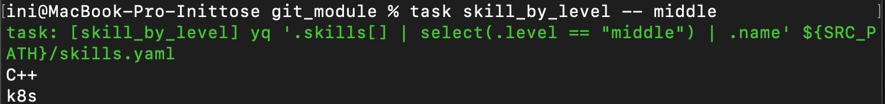

# Практическая работа №2 "Работа с Git"
## Тема: "Модуль Git"

- Подготовил Полушвайко Константин Николаевич


# YAML CV
В качестве реализации создания резюме был использован [yaml-cv](https://github.com/haath/yaml-cv).

## Настройка

Установите [yq v4](https://mikefarah.gitbook.io/yq/), например:
```shell
brew install yq@4
```

Установите [yaml-cv](https://github.com/haath/yaml-cv):
```shell
gem install yaml-cv
```

Для создания PDF-версии, требуется `wkhtmltopdf`:
```shell
brew install wkhtmltopdf
```

Установите [Taskfile](https://taskfile.dev):
```shell
brew install go-task/tap/go-task
```

## Использование

```shell
task --list-all
```

### Исходный код включает 2 компонента:
- [src/yamlcv.yaml](src/yamlcv.yaml)

  Шаблон резюме в формате [yaml-cv](https://github.com/haath/yaml-cv)
  Сюда добавляется актуальная информация не касающаяся технических навыков.
- [src/skills.yaml](src/skills.yaml)

  Список навыков в расширенном формате. Навык должен обязательно включать `category` и `name`, а так же любой набор дополнительных полей.

### Сборка

Запустите:
```shell
task build
```

### Конвертация в JSON

```shell
task json
```

### Поиск

Вывод навыков по уровню владения (`junior|middle|senior`):
```shell
task skill_by_level -- <level>
```

#### Пример

