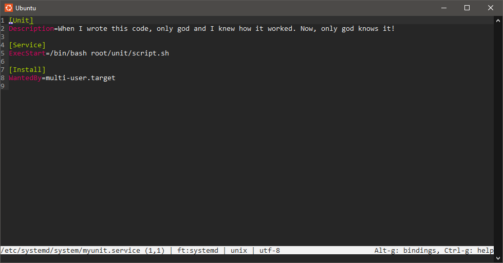
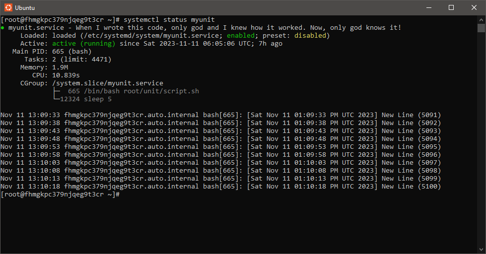
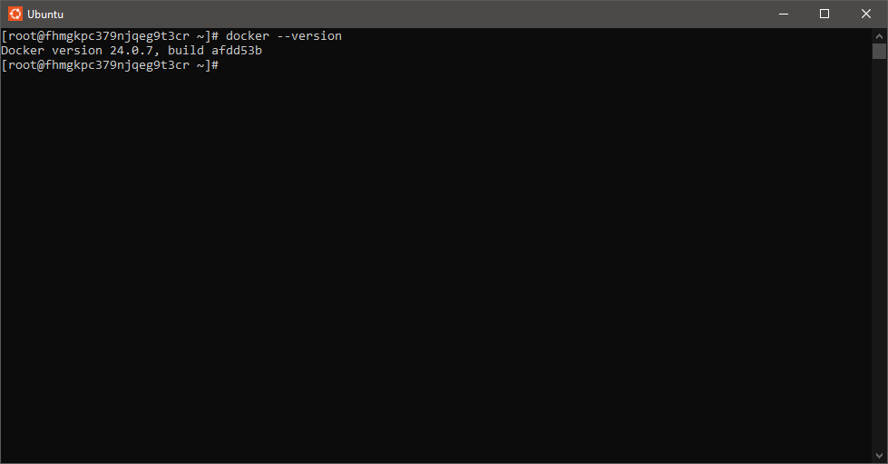
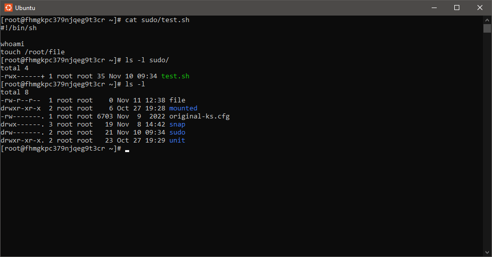
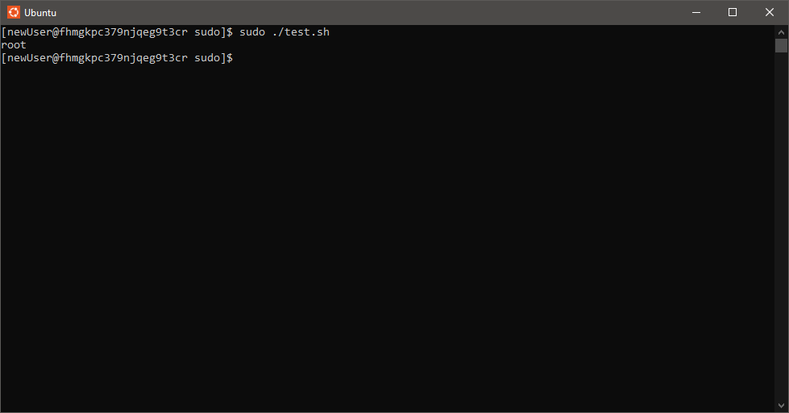
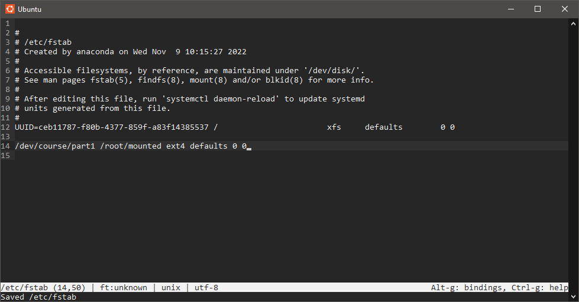

# 
 Linux module 

В качестве доказательства выполнения данного модуля прикрепил скриншоты с каждого пункта.

## Пункт 1

 Рисунок 1.1 - Unit systemd 

---

 Рисунок 1.2 - Проверка работы Unit`a

---

## Пункт 2

 Рисунок 2 - Проверка установлен ли docker

---

## Пункт 3

 Рисунок 3 - Скрипт и расставленные права 

---

## Пункт 4

 Рисунок 4 - Команда sudo запускает команды от имени root 

---

## Пункт 5

 Рисунок 5 - Автомонтировка раздела 

---
